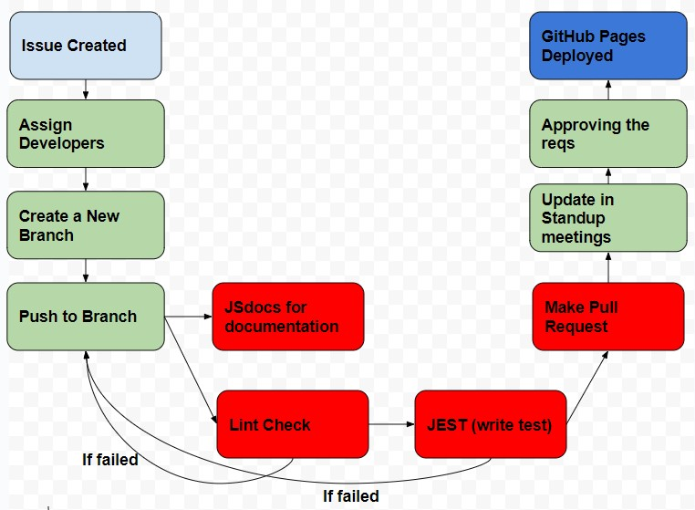

# Team 21 Project - CI/CD Pipeline Phase 1 Status

## CI/CD Pipeline Diagram

[The diagram representing our current CI/CD pipeline setup](phase1.jpg)

## Current Functionalities

### Code Style and Linting Enforcement

- Our team has established a comprehensive Style Guide that serves as a reference for maintaining consistent code style across all our webpages. This guide includes appropriate CSS and style properties to ensure a cohesive visual experience throughout our application.

- To enforce these coding standards, we are considering integrating a linter into our development environment. The linter will help identify deviations from the style guide and provide automated feedback on code quality. We plan to incorporate this linter as a GitHub action, enabling universal checks for every push. This way, we can ensure consistent code style without requiring every team member to install a linter extension locally.

### Code Quality via Human Review
- We have implemented a pull request (PR) workflow using our version control system (e.g., Git) to facilitate code reviews within the team.

- The PR mechanism allows team members to review each other's code changes, ensuring high code quality, catching bugs, and promoting knowledge sharing. To maintain integrity, it is ideal for pull requests to be reviewed and approved by someone other than the request's owner. We plan to review and merge most of the pull requests to the main branch during our weekly meetings, ensuring thorough scrutiny and alignment with the issue requirements.

### Unit Tests via Automation
- For our unit testing needs, we have chosen Jest as our testing framework.

- Using Jest, we will write and automate unit tests to ensure the correctness of individual components and functions. Although the webpages are not yet linked, we will begin testing critical functionalities in the next sprint. These unit tests will help us identify regressions as our codebase evolves and provide confidence in the stability of our application.

### Documentation Generation via Automation
- To streamline our documentation process, we are leveraging JSDoc for automated documentation generation.

- By adhering to JSDoc conventions, we can document our code, including functions, classes, and modules, and automatically generate HTML-based documentation. We intend to set up the functionality where the documentation is generated and stored in a designated location within our repository. This will enable easy access to the documentation, aiding in code comprehension and maintenance. Currently, the JSDoc functionality is displayed within our pipeline.

## Planned and In-Progress Enhancements
### Code Quality via Tools
- As part of our ongoing efforts to maintain high code quality, we are planning to incorporate Codeclimate as our code quality analysis tool.

- Codeclimate will analyze our codebase and provide valuable insights into potential issues, such as complexity, duplication, and maintainability. By generating automated code quality reports, this tool will enable us to identify areas that require improvement, ensuring that our codebase remains clean and maintainable.

### Integration Tests
- As our codebase grows, we are preparing to introduce integration tests into our pipeline.

- Using Jest, we will create integration tests to validate the interaction between different components, ensuring a seamless integration of UI/UX pages. These tests will further enhance our confidence in the functionality and reliability of our application as a whole.

### Continuous Integration Setup
- To streamline our development workflow and automate the build and test processes triggered by code changes, we plan to set up a Continuous Integration (CI) server. Jenkins is one of the CI servers we are considering for this purpose.

- By integrating a CI server into our workflow, we can automate the compilation, testing, and deployment of our application, reducing manual effort and ensuring consistent and reliable results.

### Deployment Automation
- To simplify the deployment process for the completed CSS and HTML parts of each page, we are actively exploring options for deployment automation.

- By automating the deployment process, we aim to streamline the deployment workflow and reduce the likelihood of human error. This will enable us to deliver updates and improvements to our application more efficiently and reliably.
