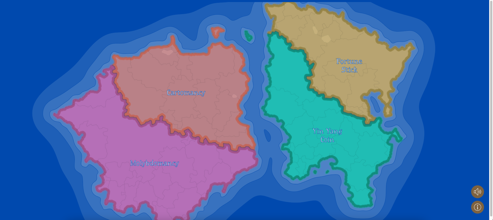
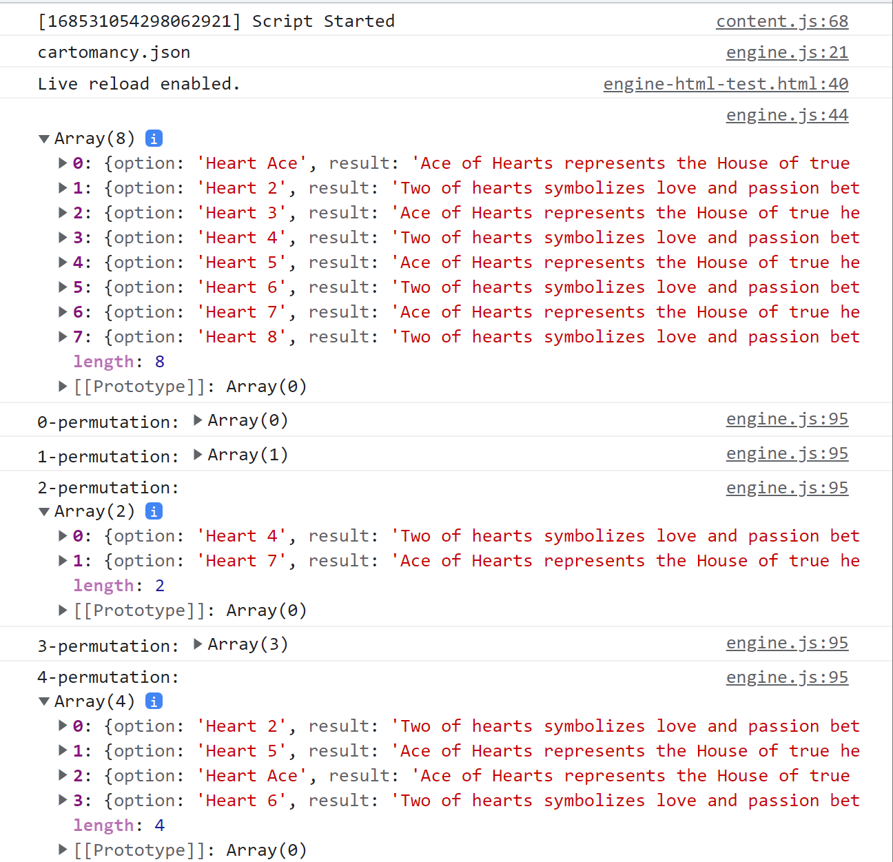

# Sprint 1 Review Meeting Notes (Friday 5/26/2023)

## Attendance
- Justin
- Michelle
- Hayden 
- Gil
- Van
- Minh
- Matthew (late)

## Progress

### Front-end team:

Jun
- Fictional Map with 4 locations is drawn in SVG format
- Highlight a specific location whenever mouse over
- Ability to drag the map continent with mouse
- Click functionality has been initialized.

Justin
- Completed Issue #3: “Sprint 1: Music/Info Button”
- Created two fixed buttons on corner of home page for toggling music and displaying instructions/info

Matthew
- Edited the audio file for the music so it would loop cleanly
- Worked with Hayden and Michelle to choose and implement the music looping on the main map screen

Hayden
- Worked with Matthew and Michelle to implement music to our main page

Michelle
- Collaborated with Matthew and Hayden to add music to main page

Saman
- Gathered the front-end team and talked about different design ideas for the mini-apps and also the homepage design requirements
- Worked with Van on tracking the progress on both the back and front-end teams
- Created Issues and worked with Matthew to put them on GitHub.

### Back end team:

Minh
- Work with Gil on how to construct the class for Engine.
- Have a sample code for cartomancy.
- Gil and I are confused on the instruction before, but has been resolved by Van

Van
- Combine the JSON reading with the FortuneEngine

Francisco
- Added a JSON reading feature for fortunes on FortuneEngine class. Worked on some of the randomization on it.

Gil
- Added CI/CD implementation + explanation (powerpoint / video)
- FortuneEngine class - added getRandomSubset method and baseline structure

## Screenshots of Sprint Progress:

Front end: Screenshot of home page map and buttons

Back end: Demo of the FortuneEngine generating random subsets of an array from a JSON file
