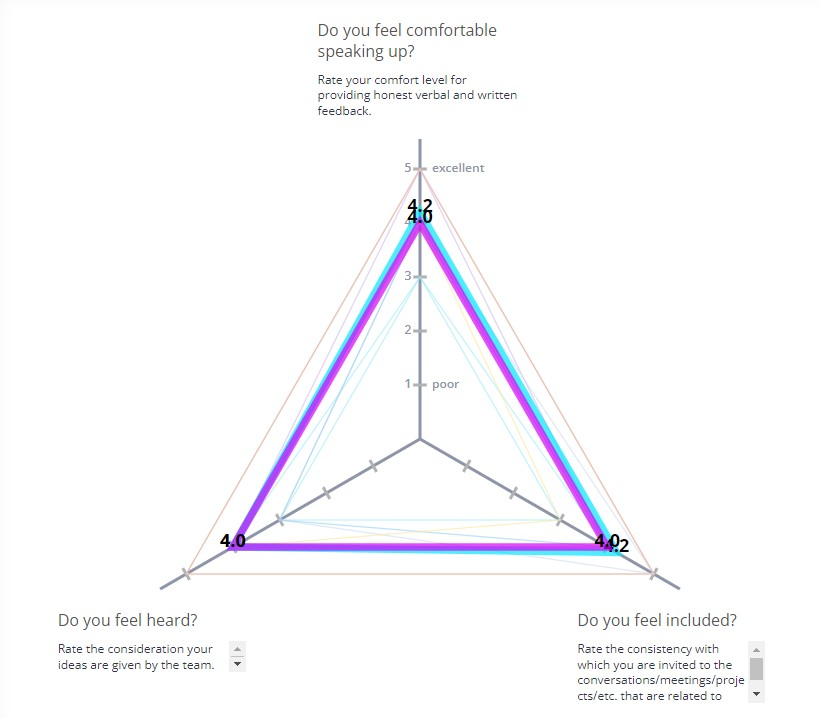
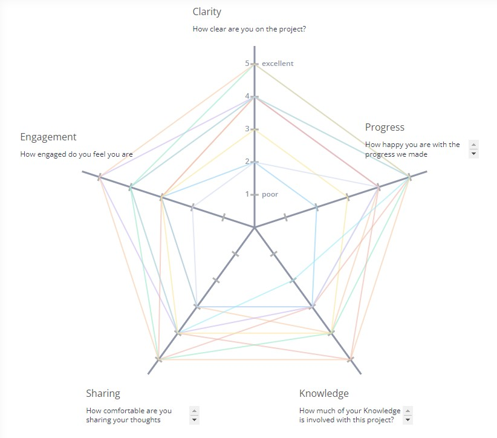
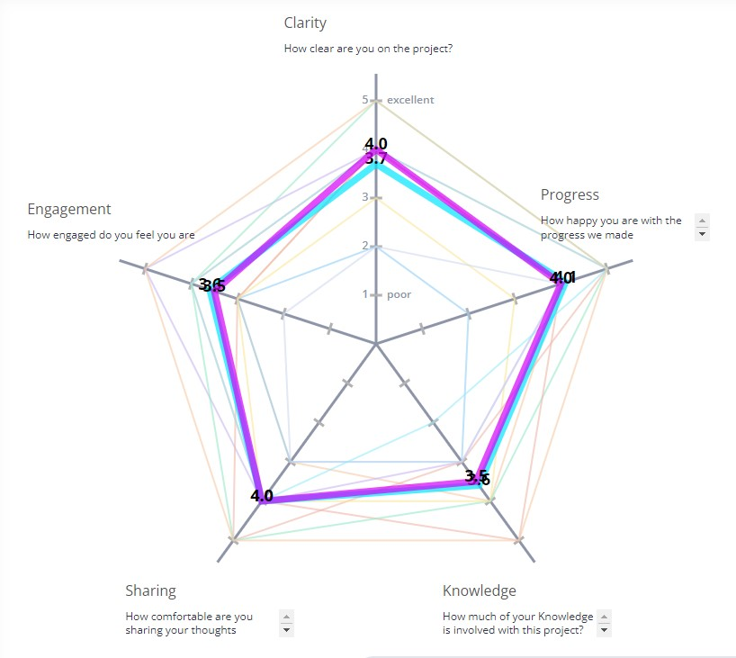

# Retrospective Meeting Notes - May 29, 2023, 1:30 PM

## **1. Survey on Project Clarity, Knowledge, Engagement, Sharing, and Progress**

We assessed the team's perception on various project dimensions such as project clarity, the application of knowledge, engagement, information sharing, and project progress. The results varied, with scores averaging between 3 and 7. It was noted that some team members felt the progression of the project and engagement levels were sub-optimal and could be improved.

## **2. Psychological Safety Assessment**

Our team's sense of psychological safety was reviewed. The average result was a level 4, indicating a reasonable level of comfort in this area. This suggests that team members generally feel safe expressing their thoughts and opinions without fear of retribution or rejection, a crucial factor for productive team dynamics.

## **3. Evaluation of Mads, Sads, Glads**

We conducted a review using the Mads, Sads, and Glads technique to better understand the team's emotional status in relation to the project.

### **Mad:**

Some team members felt that their ideas were ignored occasionally and emphasized the need for improved communication. A significant portion of the team felt that the sprints were crammed and were announced on short notice, causing difficulty in managing their time and work effectively.

### **Sad:**

There were concerns about a lack of cooperation and involvement from some team members, indicating a need for improved collaboration. Additionally, a lack of clarity on due dates was raised, which can create confusion and impact project planning and deliverables.

### **Glad:**

Despite the above issues, there were positives as well. Team members felt excited about the frontend and UI work, applauding the progress made in these areas. There was also anticipation for future sprints. They appreciated instances of effective communication and the overall momentum of the team. Both backend and frontend teams' achievements were highlighted and recognized.

## **4. Voting on Important Issues**

We conducted a poll to identify the most pressing issues the team is currently facing. The results highlighted two main concerns:

- Issues with pull requests: The current method of accepting pull requests was viewed as ineffective, indicating a need for process revision.
- Ignored ideas: Some team members expressed frustration that their ideas were not considered, which may impact team morale and innovative potential.

## **5. Skewed Level of Involvement by Team Members**

We noted that there's a varied skill set within the team, causing some disparity in the amount of work assigned. This is an issue that requires consideration to ensure a fair and balanced distribution of tasks.

## **6. Endorsement for In-Person Collaboration**

A strong consensus emerged in favor of in-person collaboration, suggesting that team members find face-to-face interactions more effective than virtual meetings via platforms like Zoom. As we progress, the potential to incorporate more in-person meetings will be explored.

By addressing the issues raised and capitalizing on the positives, we can hope to enhance our project execution and team synergy moving forward. The team's feedback provides valuable insights into areas of improvement and will guide our actions in the coming sprints.

